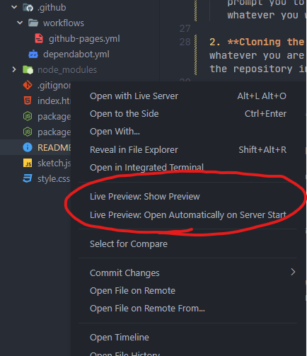

# <!--- Project Name -->

## GDD-140 <!-- Assignment Number -->

[**View Project**]()

### Project Overview

<!-- Quick Overview of the Project -->

### About the Project

This project was created as an assignment submitted for GDD-140 at Quinnipiac University. This assignment uses [p5.js](https://p5js.org/) to create a visual art on a canvas through javascript. Instead of using the suggested [p5.js editor](https://editor.p5js.org/), I decided to instead install p5.js locally and create it using vscode.

### Viewing the Project

The compiled project is automatically hosted on GitHub Pages for those who wish to simply see it. The link to the project is above, or in the description panel of this repo.

### Running the Project Yourself

If you want to download the project and take a deeper look into the code, you are welcome to! Below are instructions on how to download and work with the project:

1. **Required Programs** Running this program will require a few package managers and programs, as listed below.
   - [**git**](https://git-scm.com/): shouldn't be a surprise, you will need git in order to clone this repository
   - [**npm**](https://www.npmjs.com/): This project uses **npm** to download and manage the **p5.js** package, as well as its types. You can install **npm** by following steps on their [downloading documentation page](https://docs.npmjs.com/downloading-and-installing-node-js-and-npm).
   - [**Visual Studio Code**](https://code.visualstudio.com/): I used Visual Studio Code to create this project, and I suggest the program to those just wanting to fool around. I've included suggested packages in the repository, which VSCode will prompt you to install. If you are comfortable with other editors, please use whatever you want.

2. **Cloning the Repository** There are many ways to clone the repository. Use whatever you are more comfortable with. Below is the terminal command that will clone the repository into the current folder

```bash
git clone https://github.com/LittleTealeaf/GDD-140-Template
```

3. **Installing p5.js Packages** Next, you will need to navigate to the directory and install p5.js in the project using npm. This will create a `node_modules` directory within the project. `node_modules` will contain all of the required dependencies for the project

```bash
cd GDD-140-Template
npm install
```

4. **Opening in Visual Studio Code** For those use visual studio code, you can open the project's directory immediately in vscode using the following command

```bash
code .
```

5. **Working with the Project** With working in vscode, there are many ways to work on this project. The suggested means of working with the project is using the [Live Preview](https://marketplace.visualstudio.com/items?itemName=ms-vscode.live-server) extension on visual studio code. Once you have it installed, right click on `index.html` and select "Live Preview: Show Preview", as shown below:



6. **Start Exploring!** The script for each project is located in the `sketch.js` file. Feel free to explore and experiment with the project, and you'll view live feedback as you work!
